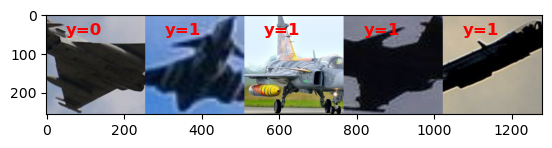
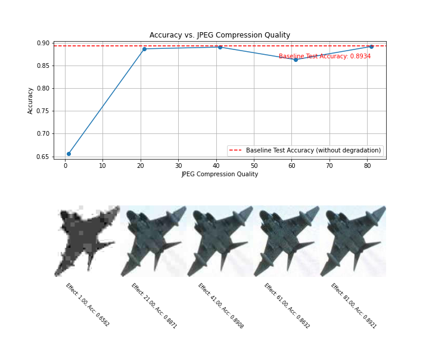
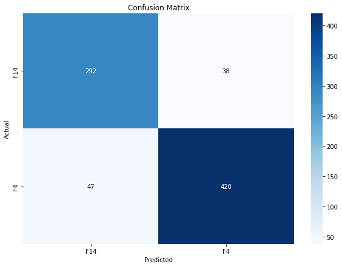
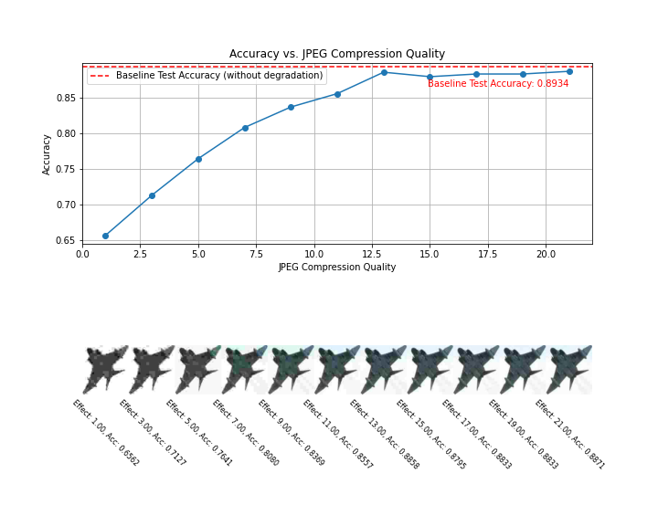
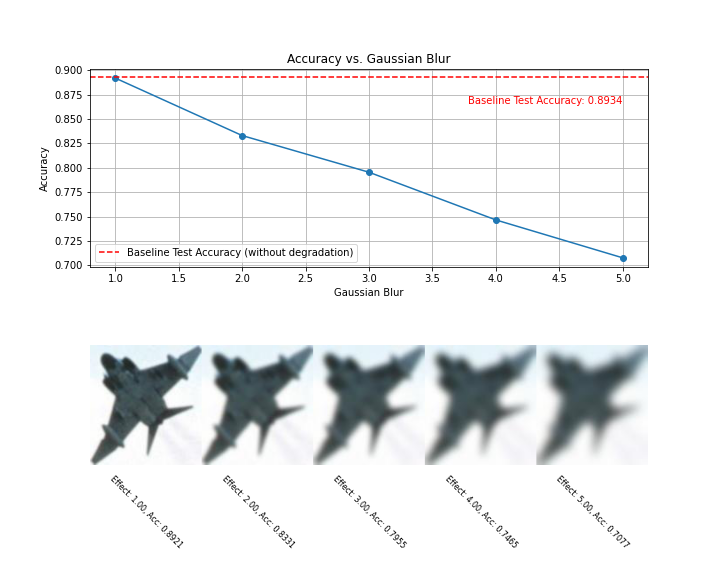
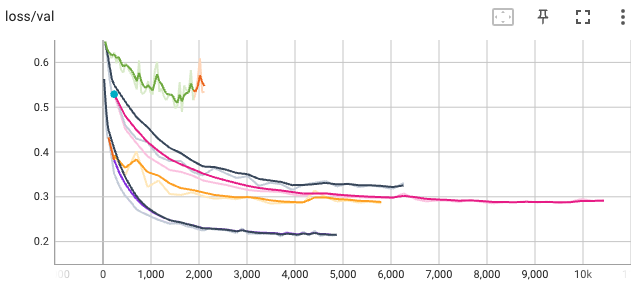
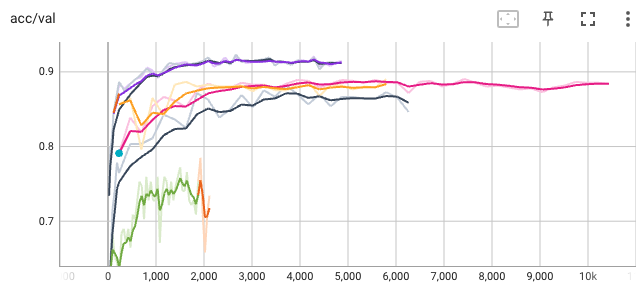

# early-detection
Early detection of military aircraft.

## Project Purpose
This project aims to explore the limits of a convolutional neural network being used as a visual early warning system for military aircraft. Image classification is at the core of the project, but the focus is on testing how the model performs in classifying military aircraft depicted with varying levels of artificial degradation to simulate real-time images taken from far away, in suboptimal conditions, and/or with insufficient equipment.

## Data Overview
The data comes from a Kaggle dataset linked [here](https://www.kaggle.com/datasets/a2015003713/militaryaircraftdetectiondataset?resource=download). The dataset encompasses more than 80 different military aircraft types, each with a varying amount of samples and image resolutions. For the purposes of this project, only two classes (F-14 and F-4) were kept and the rest were discarded. Methods for preprocessing and more are below, but it is important to note here that all images were resized and cropped to a uniform `crop_size` x `crop_size` x 3 size (`crop_size` is editable in [config.yaml](config.yaml)). An example notebook using the custom DataLoader for this project is provided in [data_demo.ipynb](notebooks/data_demo.ipynb).



## Methods Overview
### Data Setup
The data setup stage involves two main steps. First, small images (images with length or width < `crop_size`) are filtered out to ensure that only images of sufficient size are used for training. This filtering process may be executed once every time new images are added to the dataset and is handled by the script [filter_images.py](src/data_handler/filter_images.py). Second, the images can optionally be augmented to increase the dataset's diversity. This augmentation step can be performed once after the filtering process and is managed by the script [preprocess_augments.py](src/data_handler/preprocess_augments.py). Running this script will keep the original photos and then also save duplicates with each of the following properties: black and white, horizontal flip, vertical flip, and 90º rotation.

These may be ran independently as follows:
```bash
python src/data_handler/filter_images.py --config config.yaml
```
```bash
python src/data_handler/preprocess_augments.py --config config.yaml
```

Data splitting into training, validation, and test sets is managed by the script [split_data.py](src/data_handler/split_data.py), and is automatically handled by [main.py](main.py). Configure your preferred split ratio in [config.yaml](config.yaml):
```yaml
data:
    ...
    ...
    ...
    test_split: 0.15
    train_split: 0.7
    val_split: 0.15
```

### Data Preprocessing
The data preprocessing pipeline includes several steps to ensure the images are suitable for training the neural network. These steps include resizing, cropping, normalization, and data augmentation. The images are resized, cropped to a uniform size, and normalized according to the training set's mean and standard deviation. Data preprocessing augmentation techniques such as random rotations, flips, and color jitter are applied to increase the diversity of the training data and improve the model's robustness.

### Model Architecture
Three different models were explored in this project: ConvNeXt, ResNet50, and a custom model trained from scratch. ConvNeXt, a modernized convolutional neural network architecture designed to compete with vision transformers (ViTs), demonstrated superior performance in terms of accuracy and robustness compared to the other models. ResNet50, a well-established deep learning model (and also the foundation for ConvNeXt), also performed well but early on did not match the results of ConvNeXt. The custom model trained from scratch showed the least favorable results, highlighting the benefits of using pre-trained architectures for complex image classification tasks. Overall, the best results were observed with the ConvNeXt model.

`convnext` is the default `architecture` specified in [config.yaml](config.yaml), but you may change it to try training on one of either `resnet50` or `scratch`:
```yaml
model:
    architecture: convnext
    checkpoint_path: /projects/dsci410_510/Levin_MAED/convnext-epoch=40-loss/val=0.21.ckpt
```
*Note: the default `checkpoint_path` specified in [config.yaml](config.yaml) is the recommended checkpoint file to be used if you only run inference on this specific dataset with the `convnext` architecture. If you choose to train one of the provided models on this or other data, [main.py](main.py), via [train_model.py](train_model.py), will save checkpoint files in an automatically generated `checkpoints` directory in the main project directory. Change the `checkpoint_path` to whatever your best checkpoint is after training.*

### Training Procedure
The model is trained with cross-entropy loss as the criterion. The Adam optimizer is used for training, with an initial learning rate set in the [config.yaml](config.yaml) file. Checkpointing is utilized during training, monitoring validation loss. Early stopping is also implemented to prevent overfitting. Associated early stopping parameters are also configurable in [config.yaml](config.yaml):
```yaml
training:
    early_stopping:
        min_delta: 0.0001
        patience: 10
```

To train the model, run the following command:
```bash
python main.py --config config.yaml
```

*Note: This will train the model and then evaluate it on the test set as well. Be sure your config file specifies the correct data directories to read in image data from. If you would like for your images to undergo an augmentation treatment prior to training (keep originals and add black and white, horizontal flip, vertical flip, 90º rotation), first specify the path to the original data directory and the output path for the augmented data directory by changing `original_data_path` and `original_data_path_aug`, respectively.*
```yaml
data:
    original_data_path: /projects/dsci410_510/Levin_MAED/data/raw
    original_data_path_aug: /projects/dsci410_510/Levin_MAED/data/raw_aug
```

*Then, run the following line **before** running [main.py](main.py):*
```bash
python src/data_handler/preprocess_augments.py --config config.yaml
```

*Finally, enforce `with_augmentation` in [config.yaml](config.yaml) to ensure that [main.py](main.py) uses the new augmented data:*
```yaml
data:
    ...
    ...
    ...
    with_augmentation: true
```

*Now [main.py](main.py) is ready to be ran as described above.*

### Evaluation Metrics
The performance of the model, in both non-degraded and degraded tests, is evaluated using several metrics, including sklearn's classification report (which includes accuracy, precision, recall, and F1-score). A confusion matrix is also generated after training is complete and is saved as a JSON file in './outputs' by default. To view the confusion matrix, see [confusion_matrix.ipynb](notebooks/confusion_matrix.ipynb).

Specifically for the degradation tests, a more robust evaluation is necessary to truly evaluate how different degradation effects affect inference, and within each effect, to what degree do different intensities affect inference. For these tests, the code in [inference.py](inference.py) makes predictions on a test set identical to the original test set except the images have been degraded according to command line arguments passed in when the file was ran.

An `--effect` is specified, along with a `--start`, `--stop`, and `--step` to dictate by how much to alter the effect (e.g., JPEG compression quality, Gaussian blur radius, etc.). This, then, automatically creates the degraded test set, evaluates it using the model loaded with a checkpoint (specified in [config.yaml](config.yaml)), saves the evaluation metrics to a separate JSON file in './outputs', and deletes the degraded test set (no longer needed since we only need the evaluation metrics for these intermediate results). This process happens for every `--step` between `--start` and `--stop`. To visualize how a degradation effect affects the model's evaluation metrics at each `--step`, [inference_results.ipynb](notebooks/inference_results.ipynb) produces a plot like this:



At this time, the ConvNeXt implementation for this project by default supports the storing of misclassified samples. To view or analyze these misclassified samples, see [view_misclassified.ipynb](notebooks/view_misclassified.ipynb).

## Results
The results of the project demonstrated promising performance, with the ConvNeXt model achieving a baseline accuracy of 0.8934 on the non-degraded test set.

| Class       | Precision | Recall | F1-score | Support |
| ----------- | --------- | ------ | -------- | ------- |
| F14         | 0.86      | 0.88   | 0.87     | 330     |
| F4          | 0.92      | 0.90   | 0.91     | 467     |
| accuracy    |           |        | 0.89     | 797     |
| macro avg   | 0.89      | 0.89   | 0.89     | 797     |
| weighted avg| 0.89      | 0.89   | 0.89     | 797     |

The confusion matrix below provides a detailed view of the model's performance across the two classes.



Of course, model performance on non-degraded images was only half the battle; the goal was to see how well a model could perform on images with varying levels of degradation.

Below are a few examples of how accurate the model is at evaluating the same test set with different degradation techniques and strengths:

### Accuracy vs. JPEG Compression Quality (1-81%)

```bash
srun python inference.py --config config.yaml --effect jpeg_compression --start 1 --stop 81 --step 20 --input_dir /projects/dsci410_510/Levin_MAED/data/split_aug/test --output_dir /projects/dsci410_510/Levin_MAED/data/test_degraded2 --parameter_name "JPEG Compression Quality"
```

### Accuracy vs. JPEG Compression Quality (1-21%)

```bash
srun python inference.py --config config.yaml --effect jpeg_compression --start 1 --stop 21 --step 2 --input_dir /projects/dsci410_510/Levin_MAED/data/split_aug/test --output_dir /projects/dsci410_510/Levin_MAED/data/test_degraded2 --parameter_name "JPEG Compression Quality"
```

### Accuracy vs. Gaussian Blur

```bash
srun python inference.py --config config.yaml --effect gaussian_blur --start 1 --stop 5 --step 1 --input_dir /projects/dsci410_510/Levin_MAED/data/split_aug/test --output_dir /projects/dsci410_510/Levin_MAED/data/test_degraded2 --parameter_name "Gaussian Blur"
```

### Accuracy vs. Gaussian Noise (Mean = [0, 100], Std = 1)
![Accuracy vs. Gaussian Noise (Mean = [0, 100], Std = 1)](assets/acc_effect_graphs/gaussian_noise_(mean_=_[0,_100],_std_=_1)__0.0_100.0_11_0.8934.png)
```bash
srun python inference.py --config config.yaml --effect gaussian_noise --start 0 --stop 100 --step 10 --input_dir /projects/dsci410_510/Levin_MAED/data/split_aug/test --output_dir /projects/dsci410_510/Levin_MAED/data/test_degraded2  --parameter_name "Gaussian Noise (Mean = [0, 100], Std = 1)" --gaussian_noise_std 1
```

### Accuracy vs. Gaussian Noise (Mean = 5, Std = [0, 100])
![Accuracy vs. Gaussian Noise (Mean = 5, Std = [0, 100])](assets/acc_effect_graphs/gaussian_noise_(mean_=_5,_std_=_[0,_100])__0.0_100.0_6_0.8934.png)
```bash
srun python inference.py --config config.yaml --effect gaussian_noise --start 0 --stop 100 --step 20 --input_dir /projects/dsci410_510/Levin_MAED/data/split_aug/test --output_dir /projects/dsci410_510/Levin_MAED/data/test_degraded2  --parameter_name "Gaussian Noise (Mean = 2, Std = [0, 50]) " --gaussian_noise_mean 5
```

Below are some Tensorboard outputs that span multiple model builds and training runs.




## Limitations and Use
### Limitations
While it achieves some strong results, the model still has some limitations:
* Only 2 classes were trained on (F-14 and F-4)
* Still struggles with noisy images (Gaussian noise degradation)
* Degradations are applied artificially at inference time
    * May make inference slower if selected effect is computationally expensive to apply to test set
    * Artificial degradations may not always successfully mimic naturally (or not) occurring conditions that alter an image
* Not optimized on any one degradation
* Model accuracy may have room to improve (as of March 14, 2025)

### Use
The intended use of this model is to assist in the early detection of military aircraft in various conditions, potentially aiding in defense and surveillance operations.

## Conclusion
The results of this project highlight the challenges of predicting military aircraft in degraded images. As expected, degraded pictures made predictions harder for the model. Among the various degradation techniques tested, JPEG compression resulted in surprisingly good performance, even in lower compression qualities (as low as 7-13% of original image quality). Applying JPEG compression closely resembles artifacting as seen on images streamed from a remote device. Conversely, the model performed worse on images treated with Gaussian noise degradation, with classification accuracy quickly plummeting at even low applied intensities. Applying Gaussian noise intended to mimic the noise present in low-light images.

While the ConvNeXt model showed promising results, I believe there is still room for improvement. Given more time, further hyperparameter tuning and experimenting with different architectures could potentially enhance the model's baseline performance. Overall, this project demonstrates the potential and limitations of using convolutional neural networks as visual early warning systems for military aircraft under various conditions.