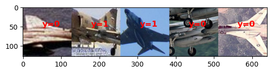

# early-detection
Early detection of military aircraft.

## Project Overview
This project aims to train a convolutional neural network for the purposes of being able to classify military aircraft earlier. Image classification is at the core of the project, but the focus is on testing how the model classifies military aircraft depicted with increased artificial distortion to simulate lower quality real-time images from farther away or in suboptimal meteorological conditions.

## Data Overview
The data comes from a Kaggle dataset linked [here](https://www.kaggle.com/datasets/a2015003713/militaryaircraftdetectiondataset?resource=download). The dataset encompasses 80 different military aircraft types, each with a varying amount of samples and image resolutions. For the purposes of this project, only two classes were kept and the rest were discarded. Methods for preprocessing and more are below, but it is important to note here that all images were resized and cropped to a uniform 256x256x3 size. An example notebook using the custom DataLoader for this project is provided in [notebooks/data_demo.ipynb](notebooks/data_demo.ipynb).

## Methods Overview
In progress

## Results
In progress

## Conclusion
In progress